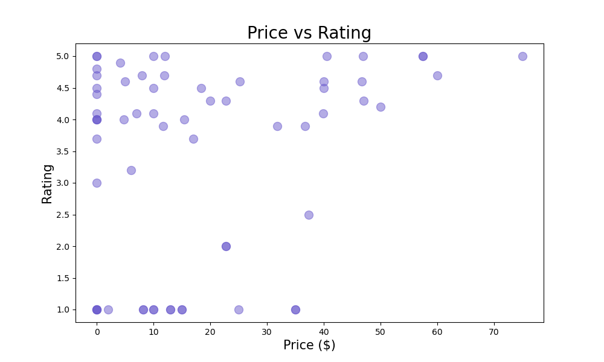

# How to get started

In your terminal run these commands.

```bash
pip install -r requirements.txt
```

## Run the file

```bash
python filename.py
```

### Menu

```bash
Choose a keyword to search for books
1 - python
2 - javascript
3 - java
4 - php
5 - perl
6 - data structures and algorithms
7 - css
Enter an option number: 1
```

> choose the books you'd like to scrape from the menu given.

## Expected results

```bash
Total books found: 290
Highest rated book: Learn Python 3 the Hard Way: A Very Simple Introduction to the Terrifyingly Beautiful World of Computers and Code (Zed Shaw's Hard Way Series)
Lowest rated book: Medusa
Highest priced book: Python Basics: A Practical Introduction to Python 3
Lowest priced book: Python for Tweens and Teens - 2nd Edition (Full Color Version): Learn Computational and Algorithmic Thinking
*********************************sample data*****************************
                                               Title  Price Rating
0  Python Programming for Beginners: The #1 Pytho...  19.34  (4.8)
1  Python 3: The Comprehensive Guide to Hands-On ...  55.48  (4.3)
2  Django 4 By Example: Build powerful and reliab...  49.99  (4.7)
3  Python Programming for Beginners: The Most Com...  18.97  (4.7)
4  Python Crash Course, 2nd Edition: A Hands-On, ...  21.49  (4.7)
//////////////////////Data Description//////////////////////////
           Price     Rating
count  17.000000  17.000000
mean   31.102353   2.529412
std    24.037053   1.504894
min     0.000000   1.000000
25%     9.990000   1.000000
50%    32.990000   2.000000
75%    44.990000   4.000000
max    69.950000   5.000000
```

## generated image example

<!-- use the css_books_plot.png from this current folder -->


